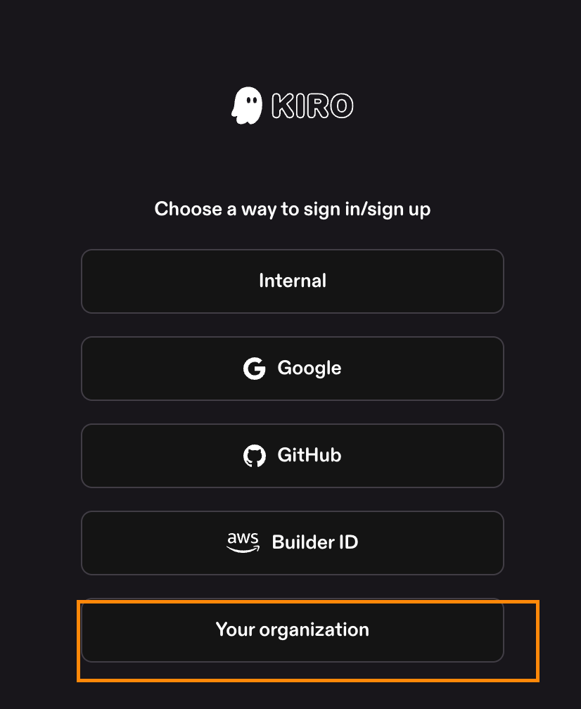

# Kiro IDE 인증

> Kiro를 처음 실행하면 로그인 화면이 나타납니다.

## 로그인 방법

### 1. Kiro 실행

설치한 Kiro를 실행합니다.

\[스크린샷: Kiro 시작 화면]

### 2. 로그인 방법 선택

네 가지 중 하나를 선택합니다:

| 방법                                        | 설명                           |
| ----------------------------------------- | ---------------------------- |
| **Continue with AWS IAM Identity Center** | 조직 AWS 계정으로 로그인 ✅ **이번 워크샵** |
| Continue with Google                      | Gmail 계정으로 로그인               |
| Continue with GitHub                      | GitHub 계정으로 로그인              |
| Continue with AWS Builder ID              | 개인 AWS Builder ID로 로그인       |

\[스크린샷: 로그인 선택 화면]

### 3. AWS IAM Identity Center로 로그인 (워크샵 방식)

**① "Continue with AWS IAM Identity Center" 클릭**

<figure><figcaption></figcaption></figure>

**② Start URL 입력**

워크샵 진행자가 안내하는 URL을 입력합니다:

```
https://[your-organization].awsapps.com/start
```

> ⚠️ 이 URL은 워크샵 당일 진행자가 안내합니다.

\[스크린샷: Start URL 입력 화면]

**③ AWS 리전 선택**

진행자가 안내하는 리전을 선택합니다 (예: `ap-northeast-2` 서울)

**④ 브라우저에서 인증**

브라우저가 열리면:

1. 조직 계정으로 로그인
2. "Allow" 클릭하여 Kiro 접근 허용
3. 인증 완료 후 Kiro로 자동 돌아옴

\[스크린샷: 브라우저 인증 화면]

### 4. 완료 확인

로그인이 성공하면 Kiro의 메인 화면이 나타납니다.

\[스크린샷: 로그인 완료 후 메인 화면]

## 문제 해결

| 증상                 | 해결 방법             |
| ------------------ | ----------------- |
| 브라우저가 안 열림         | Kiro 재시작 후 다시 시도  |
| 인증 후 Kiro로 안 돌아옴   | Kiro 창을 직접 클릭     |
| Start URL을 모르겠음    | 워크샵 진행자에게 문의      |
| "Access Denied" 에러 | 진행자에게 계정 권한 확인 요청 |

> 💡 **팁**: IAM Identity Center 로그인이 안 되면, 임시로 Google 계정으로 먼저 로그인하여 실습을 진행할 수 있습니다.
